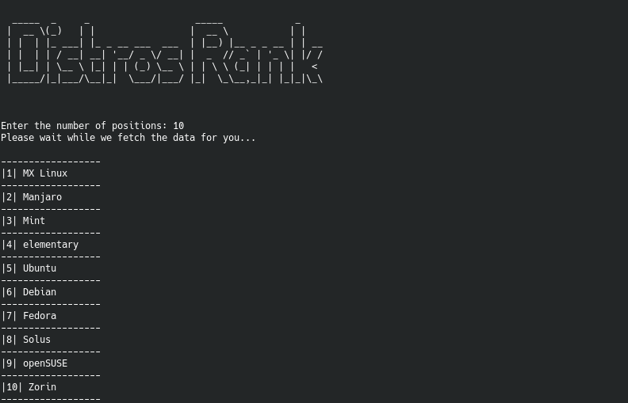

# Distros Rank

Python software to check the rank of Linux distributions.

Data is taken from [DistroWatch](https://distrowatch.com/).

## Screenshot



## Dependencies

```
pip3 install -r requirements.txt
```

## Usage

```
python3 rank.py
```

## License

This project is licensed under the terms of the [MIT license](LICENSE).
